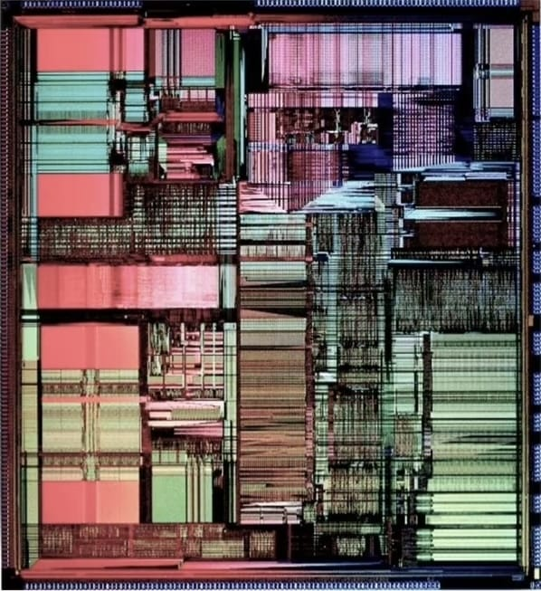

# Build It, Break It, Own It

### [Open the curriculum](https://ourworldsxr.github.io/build-break-own/)

That link is the thing itself. Clicking `index.html` in this file list shows you
270 kilobytes of source code, which is not the experience.


A weather station that has no way to send your data anywhere. And a way of
finding out who your other machines answer to.

Built by [OurWorlds](https://ourworlds.io) for AISES STEM Activities Day,
Portland, 14 October 2026. Runs on BeagleBoard hardware.

**This is a draft. The nation-name review is still open. Read
[What needs checking](#what-needs-checking) before you teach from it.**

---



## The rug that opens it

*Replica of a Chip*, woven by Marilou Schultz in 1994. It is a rug. Wool from
Navajo-Churro sheep, hand spun thinner than she normally spins it. It is also a
picture of Intel's Pentium die, accurate enough that a computer historian walked
past it in a gallery thirty years later, stopped, and worked out which chip it
was.

Traditional Navajo weaving leans on symmetry. A chip layout has none. So there
was no shortcut and nothing to repeat, and the work went at about an inch a day.
Schultz is Diné, a fourth generation weaver, and a mathematics teacher.

Intel commissioned it as a gift to AISES. It was made for the people this
curriculum is for. It opens the piece because of what it does to an old
comparison. In 1969 Fairchild put photographs of Diné women at looms next to
photographs of Diné women at microscopes, and used the likeness to explain why
the assembly work suited them and why it paid what it paid. Schultz took the
same two crafts and made the chip the thing being woven. Same comparison.
Different hands on the frame.

Used with the artist's permission. See [images/PERMISSION.md](images/PERMISSION.md)
before you reuse it, which is to say: do not.

## Wado, BeagleBoard

The [BeagleBoard.org Foundation](https://www.beagleboard.org) has sponsored the
boards for this workshop. Twelve PocketBeagle 2s, so that twelve students go
home with a computer they can read all the way down.

They did not have to. They are a non-profit with an education charter, not a
company with a marketing budget looking for a photograph. And they gave hardware
to a curriculum that spends its second half asking hard questions about who
controls hardware. That takes a particular kind of confidence.

We chose them before we asked them, for the reason the curriculum gives:
BeagleBoard publishes the full schematic, the board layout, and the parts list.
The freedom to study how a thing works is the freedom this entire workshop
stands on. On most hardware it does not exist. On theirs it does.

Wado.

## What students do

Teams of four build a weather station: a sensor, a screen, a card, a
breadboard, twelve wires. The build takes about twenty-five minutes. Without a
breadboard (Kit B) it is four wires and one module at a time; the guide covers
both. Then we ask the question that takes the
rest of the session. Who actually controls what you just built?

They trace it layer by layer: chip, firmware, operating system, application. At
each layer they write down who holds control and where that organisation sits.
Then they run the same trace on the phone in their pocket. That column comes
back empty.

The goal is not a finished weather station. The goal is a student who asks that
question every time they pick up a machine.

About $60 a station, not counting the board.

## What is here

| | |
|---|---|
| [`index.html`](index.html) | The curriculum. Open it and it starts. `B` for the twenty minute build, `T` for the full tour |
| [`worksheet.html`](worksheet.html) | Four pages to print. Pin diagram, ten steps, the trace, twelve questions |
| [`teacher-guide.html`](teacher-guide.html) | Standards, three session lengths, six things you can mark. Also as [markdown](teacher-guide.md) |
| [`sovereign-weather-station/`](sovereign-weather-station/) | The station image. Build script, drivers, verification tool, image pipeline, 30 tests, and the hardware, wiring, bench test, flashing and facilitator guides |
| [`IMAGES.md`](IMAGES.md) | Where to get photographs without stealing them |
| [`images/`](images/) | The Schultz weaving, and the terms it is here under |

## It works with nothing

No CDN. No web fonts. No analytics. Nothing is fetched at runtime, including the
photographs, which are embedded rather than linked.

Clone it, unplug the wifi, open `index.html` from the folder. It behaves
exactly the same. On 14 October there is no power and no internet in that room,
so that is the only test that counts.

## Publishing it

```
Settings -> Pages -> Deploy from a branch -> main -> / (root)
```

`.nojekyll` is already here. See [PUSHING.md](PUSHING.md).

---

## Three licences, on purpose

This curriculum argues that open source and Indigenous data sovereignty pull
against each other at one specific point. So it would be poor form to license it
carelessly.

**The code is [MIT](LICENSE-CODE).** Open source by the OSI definition. Anyone,
any purpose, no exceptions. It is a reference design. It should be forkable
without asking us, including by people we would not choose.

**The curriculum is [CC BY-NC-SA 4.0](LICENSE-CURRICULUM).** Use it, change it,
pass it on, credit us, do not sell it.

That is not an open source licence and it does not pretend to be. The Open
Source Definition forbids restricting a field of endeavour. We are restricting
one. The curriculum makes this exact argument in its own text, using Te Hiku
Media's Kaitiakitanga License as the example. Teaching that and then not making
the choice ourselves would be strange.

**The artwork is licensed to nobody.** *Replica of a Chip* (1994) by Marilou
Schultz (Diné) is here with the artist's permission, for this curriculum. Not
for yours. If you fork this, take the image out or write to her yourself. Same
goes for anything added under `IMAGES.md`, and for the BeagleBoard logo.

---

## What needs checking

File an issue. There is a template.

- **The stories.** Choctaw Code Talkers, Passamaquoddy cylinders, Fairchild at
  Shiprock, the Lakota Language Consortium, wampum, Te Hiku Media. Every fact is
  sourced. Sourced is not the same as ours to tell.
- **Every nation name.** Diné, Chahta, Peskotomuhkati, Havasu Baaja, Lakota,
  Māori. We use the name each nation uses for itself on first mention, then the
  common English name after. Tell us where that is wrong, where it is
  presumptuous, and where the diacritics are off. This is the correction we most
  expect to need.
- **The closing line** asks students to take their answer back to their
  community. Is that a fair thing to ask of a sixteen year old?
- Pin numbers on real PocketBeagle 2 hardware. Ours are inherited from the
  original PocketBeagle and are being confirmed now.
- The I2C bus number. Run `sws-check` on a board and send us the output.
- Questions 1 and 2. Currently recall. They should be reasoning.
- The count of Choctaw soldiers. Sources differ.

## In progress

The station image is in testing. The drivers pass 30 unit tests against a
simulated bus. The pin numbers and I2C bus come from BeagleBoard's published
header table and device tree; the rehearsal on real boards is still to come.

There is no `.img` in this repo, on purpose. The build script is the artifact.
The image is what the script produces, on your machine or on the GitHub Actions
runner, and either way you can read every step that made it.

The student responses array is empty. Nothing in it will ever be invented.

---

## Sources

**The artwork.** Marilou Schultz (Diné), *Replica of a Chip*, 1994. Wool,
120 x 146.1 cm. Commissioned by Intel as a gift to AISES.
[Hyperallergic profile](https://hyperallergic.com/marilou-schultz-dine-weaver-who-turns-microchips-into-art/) ·
[Colossal](https://www.thisiscolossal.com/2024/11/marilou-schultz-replica-of-a-chip/) ·
[Ken Shirriff on the Pentium weaving and Shiprock](http://www.righto.com/2024/08/pentium-navajo-fairchild-shiprock.html) ·
[Shirriff on her 555 timer weaving](http://www.righto.com/2025/09/marilou-schultz-navajo-555-weaving.html) ·
[Wikipedia](https://en.wikipedia.org/wiki/Marilou_Schultz)

**The histories.**
[Choctaw Nation of Oklahoma](https://www.choctawnation.com) ·
[Library of Congress, free to use](https://www.loc.gov/free-to-use/) ·
[Local Contexts, Traditional Knowledge Labels](https://localcontexts.org) ·
[Mukurtu CMS](https://mukurtu.org) ·
Lisa Nakamura, *Indigenous Circuits: Navajo Women and the Racialization of Early
Electronic Manufacture*, American Quarterly 66:4, 2014

**The governance.**
[CARE Principles, Global Indigenous Data Alliance](https://www.gida-global.org/careprinciples) ·
[Carroll, Hudson, Kukutai et al., Data Science Journal 2020](https://datascience.codata.org/articles/10.5334/dsj-2020-043) ·
[The First Nations Principles of OCAP, FNIGC](https://fnigc.ca/ocap-training/) ·
[#DataBack, Animikii](https://www.animikii.com) ·
[Land Back Red Paper, Yellowhead Institute](https://yellowheadinstitute.org/land-back/)

**The practice.**
[Te Hiku Media](https://tehiku.nz) and [Papa Reo](https://papareo.nz) ·
[Southern California Tribal Digital Village](https://www.sctdv.net) ·
[MuralNet](https://www.muralnet.org) ·
[Native BioData Consortium](https://nativebio.org) ·
[AUNTIE Tech Collective, AISES](https://aises.org/auntie-tech-collective/) ·
[About AISES](https://aises.org/about/)

**The technical.**
[BeagleBoard.org](https://www.beagleboard.org) ·
[PocketBeagle 2 documentation](https://docs.beagleboard.org/boards/pocketbeagle-2/) ·
[BeagleBoard Imaging Utility](https://www.beagleboard.org/bb-imager) ·
[Official images](https://www.beagleboard.org/distros) ·
[Brand use](https://www.beagleboard.org/brand-use) ·
[The Open Source Definition](https://opensource.org/osd) ·
[The Free Software Definition](https://www.gnu.org/philosophy/free-sw.html)

**The standards.**
[CSTA K-12 Computer Science Standards](https://csteachers.org/k12standards/) ·
[Next Generation Science Standards](https://www.nextgenscience.org)

---

OurWorlds. [ourworlds.io](https://ourworlds.io)
