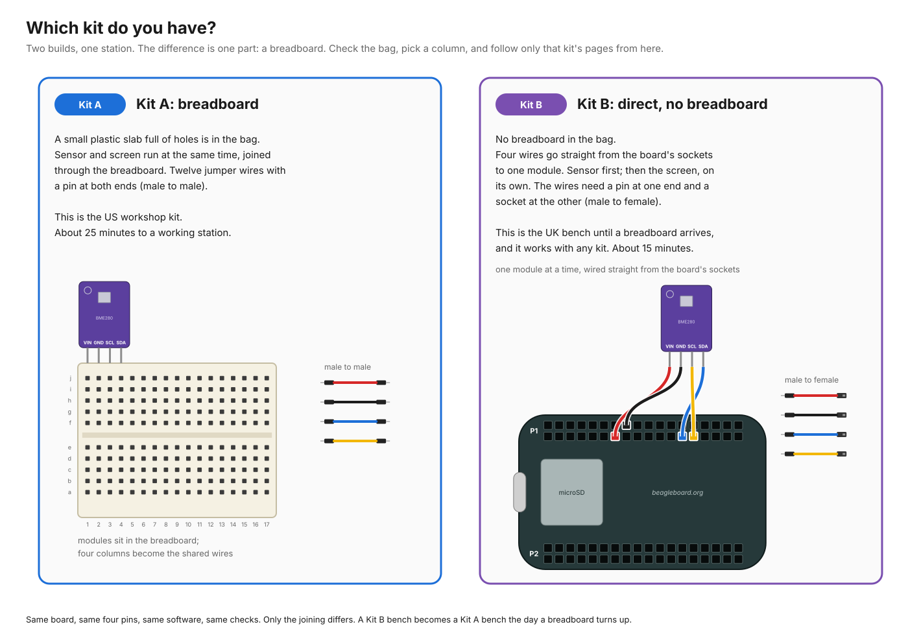
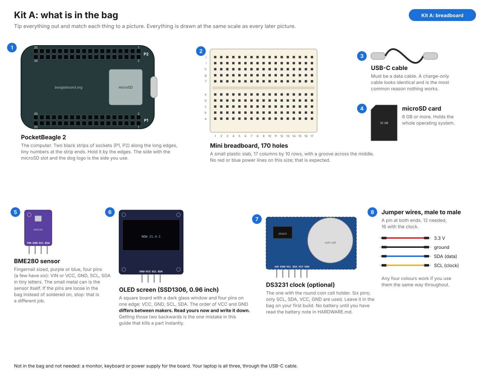
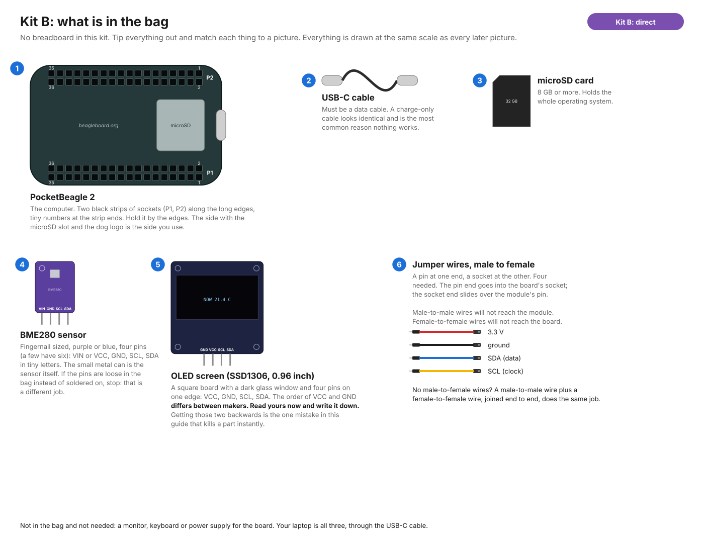
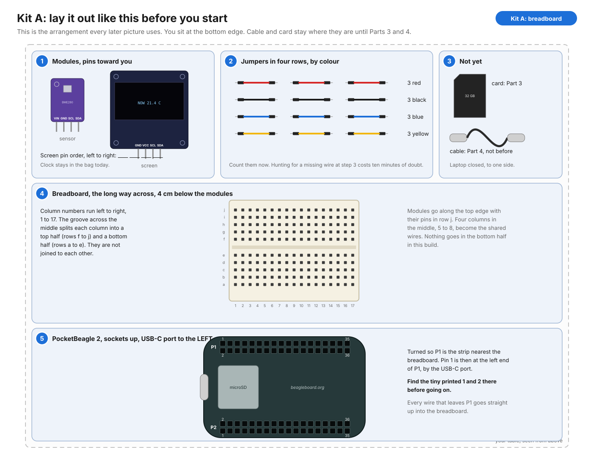
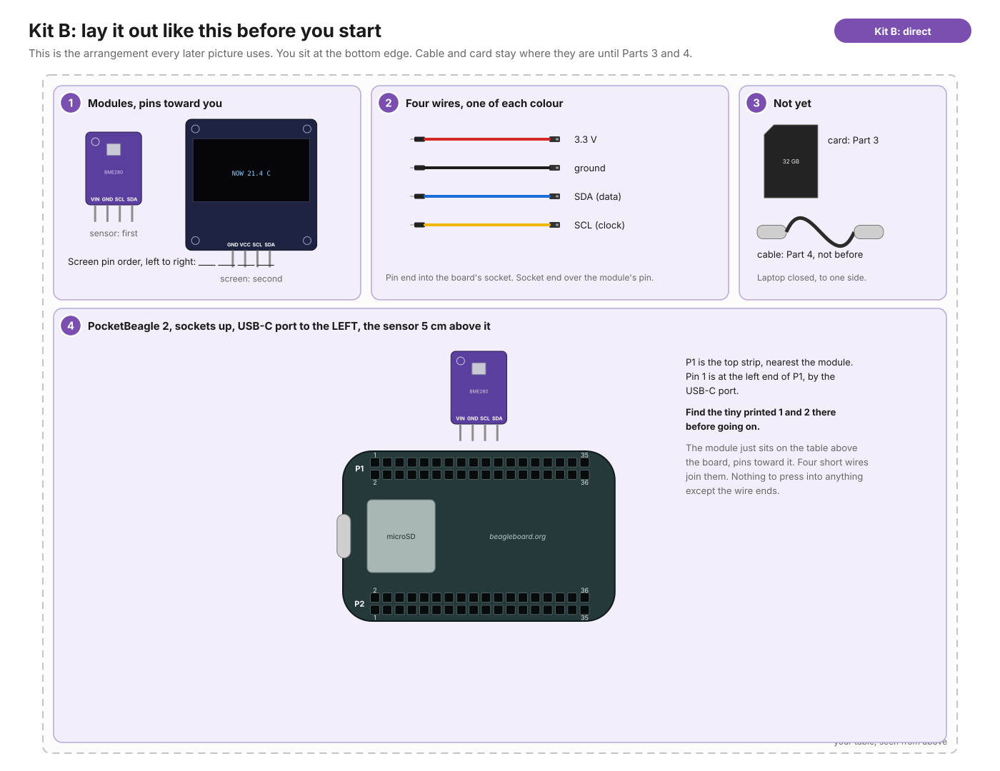
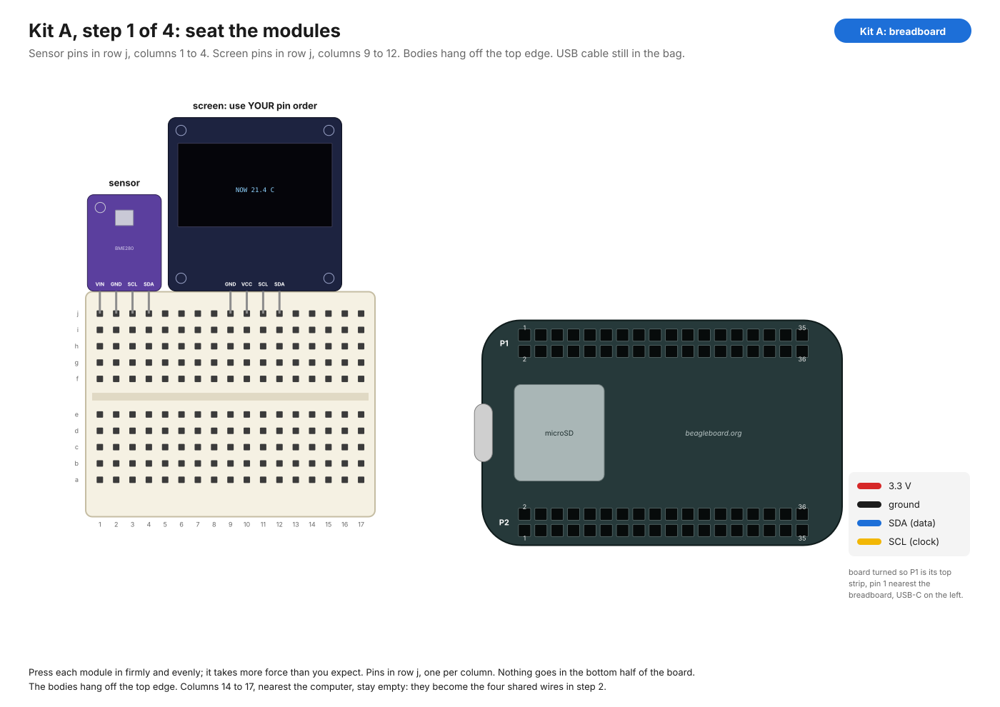
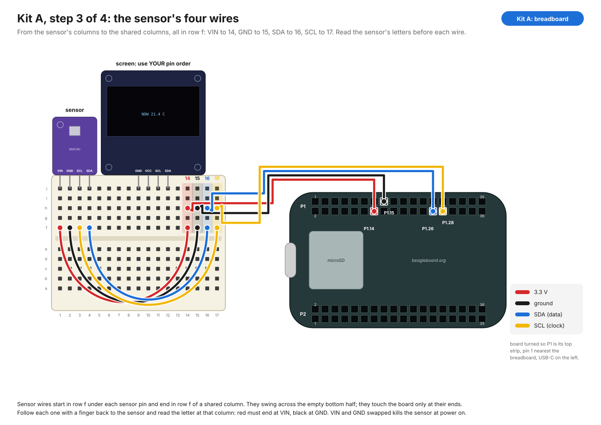
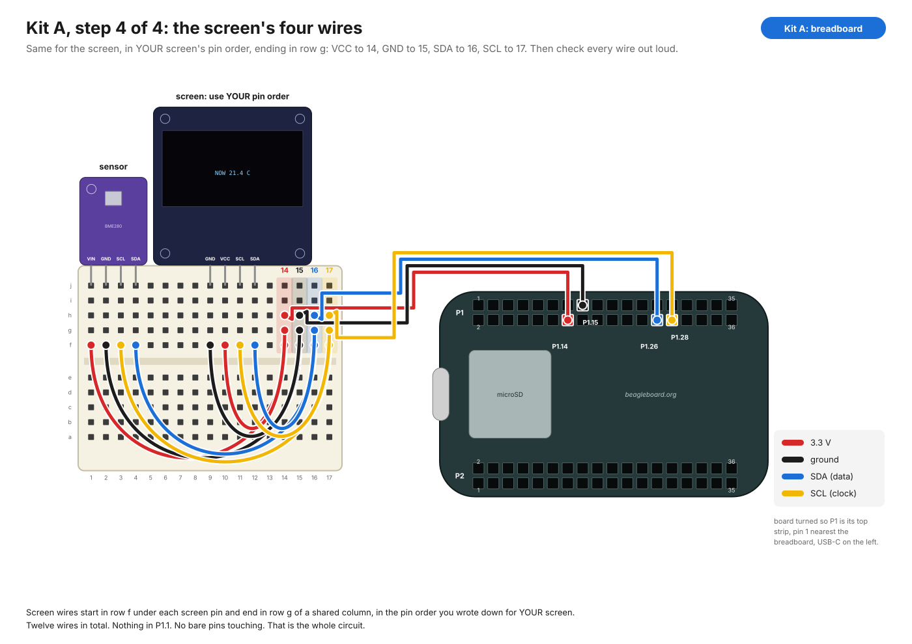
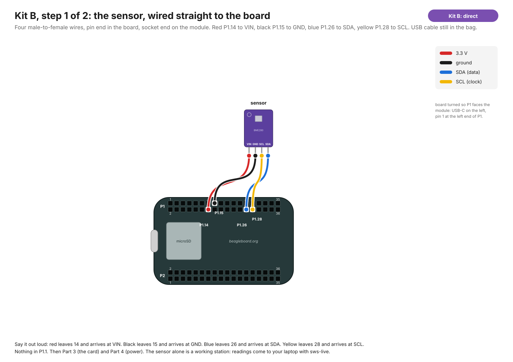
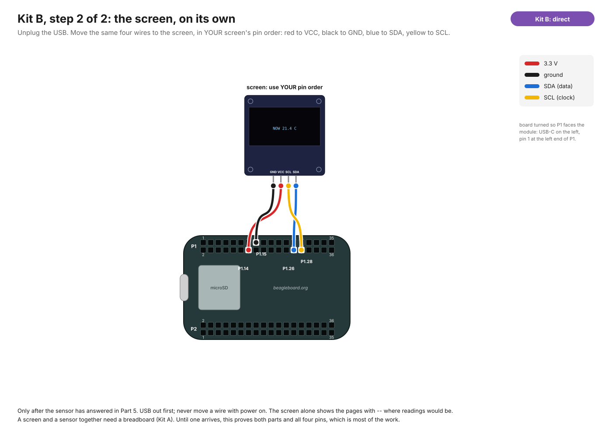

# First build, from zero

For someone who has never wired a board. Nothing here assumes you know what a
breadboard is, which end of a jumper goes where, or what I2C means. It takes
about two hours the first time, most of it waiting for downloads. Nothing you
do here can hurt you; a couple of mistakes can hurt the parts, and every one
of those is called out before the step where it can happen.

If a step's result doesn't match what's written, stop there and read the
"if it doesn't" note under it. Don't go on to the next step hoping it sorts
itself out; each step is a check on the one before.

---

## Part 0: which kit do you have? (2 minutes)



Tip the bag out. If there is a **small plastic slab full of holes**, you have
**Kit A**. If there isn't, you have **Kit B**. That one part decides which
wiring section you follow; everything else in this guide is the same.

| | Kit A: breadboard | Kit B: direct |
|---|---|---|
| What's in it | board, card, cable, sensor, screen, breadboard, 12 male-to-male jumpers, sometimes a clock | board, card, cable, sensor, screen, 4 male-to-female jumpers |
| What runs | sensor and screen together, a complete station | one module at a time: sensor first, then the screen on its own |
| Where it comes from | the US workshop order | the UK bench until a breadboard arrives; also any kit that lost its breadboard |
| Wiring section | Part 2A | Part 2B |
| Print sheets | [FIRST-BUILD-kit-A.pdf](images/print/FIRST-BUILD-kit-A.pdf) | [FIRST-BUILD-kit-B.pdf](images/print/FIRST-BUILD-kit-B.pdf) |

Kit B is not a lesser build. It proves the same four pins, the same sensor
and the same screen with fewer parts, and the sensor on its own is a working
logger whose readings you read on the laptop. It only can't show sensor and
screen at once, because two modules on one set of sockets need something to
join the wires, and that something is the breadboard. A Kit B bench becomes
a Kit A bench the day one turns up.

A note on jumper wires, because it's the thing most likely to be wrong in a
bag. The board's header is **sockets**. Module pins are **pins**. A
breadboard has **holes**. So Kit A uses pin-to-pin wires (male to male):
board socket to breadboard hole, breadboard hole to breadboard hole. Kit B
uses pin-to-socket wires (male to female): pin end into the board, socket end
over the module's pin. Male-to-male wires can't grip a module pin;
female-to-female wires can't enter the board. If you only have the wrong
kind, a male-to-male and a female-to-female joined end to end make one
male-to-female.

---

## Part 1: know the parts (10 minutes)

### What's in the bag





Match each thing on the table to the picture for your kit. If something in
the bag isn't in the picture, leave it in the bag.

### The board


The PocketBeagle 2 is a computer the size of a large postage stamp. It has
two long strips of black sockets along its long edges, called **P1** and
**P2**. Each strip is two rows of 18 sockets, 36 in all, and each socket is
a numbered **pin** that the computer can talk through.

The picture above shows the board with the **USB-C port on the right**, the
way BeagleBoard's own photos show it. On your table it is turned the other
way (USB-C left) so that P1 is nearest the breadboard; the numbers are the
same, only the direction you count in flips. Either way you are looking at
the side with the microSD slot and the dog logo, and P1 is the strip with the
printed `1` and `2` at the USB-C end. Tiny numbers are printed on the board at the ends of each
strip: **1 and 2 at the USB-C end, 35 and 36 at the far end**. On P1, odd
numbered pins are in the outer row (nearest the edge), even numbered pins in
the inner row.

Find these four sockets on P1, counting columns from the USB-C end:

| Pin | Where | What it is |
|---|---|---|
| **P1.14** | column 7, inner row | 3.3 volt power out |
| **P1.15** | column 8, outer row | ground (the return path for power) |
| **P1.26** | column 13, inner row | SDA, the data wire |
| **P1.28** | column 14, inner row | SCL, the clock wire |

On your table, with USB-C to the left, count those columns from the left end
of P1. Put a bit of tape or a pencil dot next to them if it helps. Note that
**P1.1, the socket in the corner nearest the USB-C port, is 5 volts**. It
looks exactly like the others. We never use it, and a wire from it to any of
our modules will destroy that module.

Handle the board by its edges. Before you touch it the first time, touch
something metal and earthed (a radiator, the metal case of a plugged in
laptop charger) to let any static off your hands.

### The sensor: BME280

A board about the size of a fingernail with four (sometimes six) pins along
one edge. It measures temperature, air pressure and humidity. The pins are
labelled on the board in tiny letters: `VIN` or `VCC` (power in), `GND`
(ground), `SCL` (clock), `SDA` (data). If yours has `CSB` and `SDO` too,
ignore them; they stay unconnected.

If the pins are loose in a bag rather than soldered on, stop: they need
soldering first, and that is a separate job. The UK kit parts should arrive
with the header pins already attached. Check.

### The screen: SSD1306 OLED

A small dark glass rectangle on a board, four pins along the top edge:
`VCC`, `GND`, `SCL`, `SDA`. **The order of the first two varies by maker.**
Some boards go GND, VCC, SCL, SDA; others go VCC, GND, SCL, SDA. They look
identical otherwise. Read the letters printed beside the pins on *your*
screen and write the order down now. Getting VCC and GND backwards on the
screen is the one mistake in this guide that can kill a part instantly.

### The clock: DS3231 (optional, skip on the first build)

A module with a round coin cell holder and six pins along one edge: `32K`,
`SQW`, `SCL`, `SDA`, `VCC`, `GND`. Only the last four are used. Do not put a
battery in it yet; there is a warning about that in HARDWARE.md. On your
first build leave the clock in the bag. Add it once everything else works.

### The breadboard (Kit A)

A plastic slab of 170 holes: 17 columns, 10 rows, a groove across the middle.
Inside, the holes are joined into hidden wires in a fixed pattern, and that
pattern is the whole trick:

- The holes are in **columns of five**. The five holes above the groove in one
  column are joined together; the five below the groove are a separate wire.
  Column 3 top is one wire; column 3 bottom is another; column 4 top is
  another again.
- There are **no power rails** on this size of board (no red and blue lines
  along the edges). That is expected. We make four columns do that job.

So: to join several things, put a wire from each of them into the same
column. In this build, columns 14 to 17 are the four shared wires: 3.3 V,
ground, SDA, SCL.

### Jumper wires

Stiff wires with a metal end that pushes into a hole or onto a pin. Colour is
only a convention, but keep to it, because it is how you check your work:
**red for 3.3 V, black for ground, blue for SDA, yellow (or white) for SCL**.
If your pack lacks those colours, pick four and write them down.

### Lay it out

Same arrangement as every later picture, so nothing has to be turned round
in your head. You sit at the bottom edge.





1. **Top left: the sensor and the screen**, pins pointing toward you. Read
   the letters beside the screen's four pins and write the order on a scrap
   of paper. Clock, if you have one, stays in the bag.
2. **Top centre: the jumpers, sorted by colour.** Kit A: three each of red,
   black, blue, yellow. Kit B: one of each. Count them.
3. **Top right: the card and the cable.** They stay there until Parts 3 and 4.
4. **Kit A only, middle: the breadboard**, long way across, column 1 on the
   left, 4 cm below the modules.
5. **Bottom: the board**, socket strips facing up, **USB-C port on the left**.
   The strip nearest the top of the table is P1; find the tiny printed `1`
   at its left end, by the USB-C port.

Laptop closed, to one side. Nothing is plugged in.

## Part 2A, Kit A: build it on the breadboard, USB cable still in the bag (20 minutes)

Nothing is live until the cable goes in at Part 4. Kit B, skip to Part 2B.

### Step A1: seat the modules



Push the sensor's pins into the **top row (row j)**, columns 1 to 4, so each
pin is in its own column and the body hangs off the top edge. Press firmly
and evenly; it takes more force than you expect.

Push the screen in the same way, columns 9 to 12. Leave columns 14 to 17
empty; they are the shared wires. Leave the clock out for now.

**Check:** every pin in a different column, all in row j, nothing below the
groove, columns 14 to 17 empty.

### Step A2: four wires from the board


Turn the board so P1 is its top strip and pin 1 is at the end nearest the
breadboard (USB-C on the left). Count columns from the pin 1 end.

- **Red**: P1.14 (column 7, inner row) to breadboard column 14, row h.
- **Black**: P1.15 (column 8, outer row) to column 15, row h.
- **Blue**: P1.26 (column 13, inner row) to column 16, row h.
- **Yellow**: P1.28 (column 14, inner row) to column 17, row h.

Pushing a jumper into the board's sockets needs a firm straight push. If it
won't go, you're between sockets; look again.

**Check, slowly, out loud:** "Red leaves the board at fourteen, inner row,
and arrives at column fourteen. Black leaves at fifteen, outer row, and
arrives at fifteen. Blue leaves at twenty-six and arrives at sixteen. Yellow
leaves at twenty-eight and arrives at seventeen." The socket in the corner
nearest the USB-C port, outer row, is P1.1, the 5 V pin: nothing in it.

### Step A3: the sensor's four wires



Each wire starts in **row f** under one of the sensor's pins and ends in
**row f** of a shared column. It swings across the empty bottom half; it
touches the board only at its two ends.

- **Red**: the sensor's `VIN` column to column 14.
- **Black**: the sensor's `GND` column to column 15.
- **Blue**: the sensor's `SDA` column to column 16.
- **Yellow**: the sensor's `SCL` column to column 17.

**Check, and this is the important one:** follow the red wire with a finger
from column 14 back to the sensor and read the letter printed at that pin. It
must say VIN or VCC. Follow the black one; it must end at GND. If either is
wrong, swap them now. VIN and GND backwards kills the sensor the moment power
arrives. SDA and SCL backwards just means nothing answers.

### Step A4: the screen's four wires



Same again for the screen, using the pin order you wrote down in Part 1, and
ending in **row g** of each shared column this time (row f is taken):
`VCC` to 14, `GND` to 15, `SDA` to 16, `SCL` to 17.

**The final look:** twelve wires. Three in each of columns 14 to 17 (rows f,
g, h). Nothing in P1.1. No wire end floating. No two bare pins touching.
That is the whole circuit: four wires, shared.

Go to Part 3.

## Part 2B, Kit B: wire the sensor straight to the board, USB cable still in the bag (5 minutes)

Nothing is live until the cable goes in at Part 4.

### Step B1: the sensor



Turn the board so P1 is its top strip and pin 1 is at the left end (USB-C on
the left). Lay the sensor on the table about 5 cm above it, pins toward the
board. Four male-to-female wires: **pin end into the board's socket, socket
end over the sensor's pin.**

- **Red**: P1.14 (column 7 from the pin 1 end, inner row) to `VIN`.
- **Black**: P1.15 (column 8, outer row) to `GND`.
- **Blue**: P1.26 (column 13, inner row) to `SDA`.
- **Yellow**: P1.28 (column 14, inner row) to `SCL`.

**Check, out loud:** "Red leaves fourteen and arrives at VIN. Black leaves
fifteen and arrives at GND. Blue leaves twenty-six and arrives at SDA. Yellow
leaves twenty-eight and arrives at SCL." Nothing in P1.1, the corner socket
by the USB-C port. Red and black swapped kills the sensor at power on; blue
and yellow swapped only means nothing answers.

Go to Part 3. The screen comes in Step B2, after the sensor has answered.

### Step B2: the screen, on its own (after Part 5)



Only once the sensor has answered in Part 5. **Unplug the USB first**; never
move a wire with power on. Slide the four socket ends off the sensor and onto
the screen, in the pin order you wrote down: red to `VCC`, black to `GND`,
blue to `SDA`, yellow to `SCL`. Plug in, wait 40 seconds, and the screen
lights and shows its pages with `--` where readings would be. `sws-check`
now lists `0x3C` and no sensor. Both parts proven, all four pins proven.

## Part 3: put a system on the card (20 minutes, mostly download)

The board has no software of its own. It boots whatever is on the microSD
card. For the first test we use BeagleBoard's own image, which has the tools
for checking wiring built in, and none of our code. That way if something is
wrong we know it is the wiring.

1. On the Mac, download and open the **BeagleBoard Imaging Utility** from
   https://www.beagleboard.org/bb-imager. If macOS refuses to open it, right
   click the app, choose Open, and confirm.
2. Put the microSD card in a reader and plug the reader into the Mac.
3. In the utility: **Board**: PocketBeagle 2. **Image**: the newest entry
   whose name contains "Debian" and "IoT" (not "WorkShop"). **Storage**:
   your card. It will be listed by size; make sure it is the card and not
   your Mac's own disk.
4. Press **Edit**. Set a username (say `bench`) and a password you will
   remember. Leave the rest alone. Save.
5. Press **Write**. It downloads roughly 1 GB, writes, then verifies. Wait
   for it to say it is finished; it can take ten minutes.
6. Eject the card in Finder, take it out of the reader.

**If it doesn't:** "Write failed" usually means the card was ejected or the
reader is flaky. Try again with the card in a different USB port.

---

## Part 4: first power (5 minutes)

1. Slide the card into the slot on the board, label side facing outward
   (away from the board), until it clicks. It goes in most of the way and
   stays put.
2. Now, and only now, plug the USB-C cable into the board and the other end
   into the Mac.
3. Watch the board. A power light comes on at once. Within about ten
   seconds one or more small lights start to blink: that is Linux starting.
   The screen on the breadboard stays **dark** on this image, and that is
   correct: BeagleBoard's image doesn't know about the screen. It lights up
   in Part 6, once our software is on.
4. On the Mac, open **Terminal** (Spotlight: type Terminal).

**If it doesn't:** no lights at all means no power: try another USB-C port
on the Mac, then another cable. A power light but no blinking after a
minute means the card isn't seated or the write didn't finish; power off
(unplug), reseat the card, try again.

---

## Part 5: prove the wiring (10 minutes)

Everything in this part is typed into Terminal. Type each line, press
return, read what comes back.

### 5.1 Reach the board

```
ssh bench@192.168.6.2
```

(Use the username you chose. If that address doesn't answer after a few
seconds, `Control-C` and try `192.168.7.2`.) The first time, it asks whether
to trust the new host: type `yes`. Then it asks for the password. Nothing
appears as you type it; that's normal. You now have a prompt on the board
itself, something like `bench@BeagleBone:~$`.

**If it doesn't:** "Connection refused" or a long silence: give it another
30 seconds; the board takes a while on first boot. Still nothing: on the Mac,
System Settings, Network. A new entry (often called "BeagleBone" or "RNDIS")
should have appeared when you plugged in. If not, the cable is charge only.
Change the cable. This is the single most common failure.

### 5.2 See the I2C buses

```
ls /dev/i2c-*
```

Expect exactly: `/dev/i2c-0  /dev/i2c-2  /dev/i2c-3`. There is no `i2c-1`;
that is correct on this board. `i2c-2` is the one wired to P1.26 and P1.28.

### 5.3 See who is on the wire

```
sudo i2cdetect -y -r 2
```

(`sudo` asks for your password again.) You get a grid of dashes. Somewhere in
it two numbers should appear:

```
     0  1  2  3  4  5  6  7  8  9  a  b  c  d  e  f
00:                         -- -- -- -- -- -- -- --
10: -- -- -- -- -- -- -- -- -- -- -- -- -- -- -- --
20: -- -- -- -- -- -- -- -- -- -- -- -- -- -- -- --
30: -- -- -- -- -- -- -- -- -- -- -- -- 3c -- -- --
40: -- -- -- -- -- -- -- -- -- -- -- -- -- -- -- --
50: -- -- -- -- -- -- -- -- -- -- -- -- -- -- -- --
60: -- -- -- -- -- -- -- -- -- -- -- -- -- -- -- --
70: -- -- -- -- -- -- 76 --
```

`3c` is the screen answering. `76` (or `77`) is the sensor answering. **Kit A:
if you see both, the wiring is right. Kit B: you see only `76` now; `3c`
comes at Step B2.** Take a photo of the breadboard; that is
the reference photo for every station after this one.

**If it doesn't:**

| Grid shows | Meaning | Do |
|---|---|---|
| `3c` only | screen fine, sensor not answering | unplug USB. check the sensor's four wires, especially that its SDA and SCL wires reach columns 16 and 17 |
| `76`/`77` only | sensor fine, screen not | unplug USB. check the screen's wires; recheck the pin order you wrote down |
| nothing | neither answers | unplug USB. most likely SDA and SCL are swapped at the board end (P1.26 vs P1.28), or a power wire is in the wrong column or socket |
| `command not found` | the tool isn't installed on this image | `sudo apt update && sudo apt install -y i2c-tools`, which needs the board to have internet: see Part 6, step 1 |
| a whole row of numbers | SDA and SCL shorted together or to power | unplug USB immediately. look for two bare pins touching |

### 5.4 Ask the sensor what it is

```
sudo i2cget -y 2 0x76 0xd0
```

(Use `0x77` if that is where it appeared.) `0x60` means a real BME280.
`0x58` means a BMP280, which is the same board without the humidity sensor;
it still works, humidity will show as `--`. Anything else, or an error,
means the sensor's data wires are marginal: reseat them.

Wiring is done. Type `exit` to leave the board. Kit B: do Step B2 now, then
come back here and run `i2cdetect` again for the screen.

---

## Part 6: put our software on it (30 minutes)

Now the same card gets the weather station software on top of BeagleBoard's
image. This is the software that will be on the release image, tested here
before it is published. It needs internet on the board once, to fetch three
small packages.

### 6.1 Give the board internet through the Mac

On the Mac: System Settings, General, Sharing, **Internet Sharing**. Click
the (i) next to it. Share your connection from: Wi-Fi. To computers using:
tick the BeagleBone / RNDIS entry. Close, then switch Internet Sharing on and
confirm.

### 6.2 Copy the software over

Still on the Mac, in Terminal. This assumes your clone of the repo is at
`~/build-break-own` (from the earlier git steps; if it is elsewhere, change
the path):

```
cd ~/build-break-own
scp -r sovereign-weather-station bench@192.168.6.2:~/
```

It asks for the board's password and copies the folder.

### 6.3 Install it

```
ssh bench@192.168.6.2
cd sovereign-weather-station
sudo ./setup.sh
```

It prints what it is doing: installs packages (this is the part that needs
internet), copies files to `/opt/sws`, enables three services, and ends
with `done. reboot, then run: sws-check`. Every change it makes is listed in
CHANGES.md, so nothing here is hidden.

**If it doesn't:** errors about `apt-get update` or "Temporary failure
resolving" mean the board has no internet; go back to 6.1. Anything else,
copy the last ten lines it printed and open an issue.

```
sudo reboot
```

Your terminal disconnects. Wait a minute. **Kit A: watch the screen on the
breadboard; it should light up and show `NOW` with a temperature**, changing
page every five seconds. Kit B: nothing to see yet; the sensor is logging and
you'll read it from the laptop in the next step.

### 6.4 Run the check

```
ssh bench@192.168.6.2
sws-check
```

Five questions. Read each answer. Question 2 should list `0x3C` and your
sensor. Question 3 should say "real BME280". Question 5 should say there is
no radio on this board. Question 4 will say the time came from
`fake-hwclock`, which is correct without a clock module.

```
sws-live
```

A line every two seconds. Cup your hand over the sensor, or breathe on it:
the temperature and humidity move within a few readings. `Control-C` stops
it.

**If it doesn't:** screen dark but `sws-check` found `0x3C`:

```
journalctl -u station -n 30
```

and read the last lines. Paste them into an issue if they don't make sense.

### 6.5 Leave it running

Unplug the USB cable. Plug the board into a USB power bank or phone charger.
The screen keeps cycling. That is a weather station with no network that
answers to nobody. Leave it overnight. In the morning, plug the USB back into
the Mac, `ssh` in, and:

```
cat /data/readings.csv
```

One line per five minutes, written to the card once an hour.

---

## Part 7: add the clock (optional, 15 minutes)

Kit A only (it needs the shared columns). Only after Parts 1 to 6 pass, and
only after reading the battery warning in HARDWARE.md. With the USB
unplugged: the mini breadboard is full along its top edge, so seat the
DS3231 in the **bottom** half, pins in row a, columns 12 to 17, body hanging
off the bottom edge; then four wires from its columns (row b) up to **row i**
of the shared columns: `VCC` to 14, `GND` to 15, `SDA` to 16, `SCL` to 17. `32K` and `SQW` stay empty. Fit the coin cell **only if** you
have disabled the module's charging resistor or are using a rechargeable
LIR2032.

Plug in, wait a minute, `ssh` in, `sws-check`. Question 2 now also lists
`0x68` (and `0x57`), and question 4 says a hardware clock is bound. The clock
module knows nothing yet, so set it once by hand. Look at a real clock, and
type the current time in UTC (UK summer time minus one hour, UK winter time
as is):

```
sudo date -u -s "2026-10-01 14:30:00"
sudo hwclock -w --utc
```

The first line sets the board's clock; the second copies it into the
DS3231, which keeps it on the coin cell.

From now on the board keeps time through power cuts.

---

## What you have proved

- The four wire I2C bus works on P1.14 / P1.15 / P1.26 / P1.28, on your kit.
- The screen and sensor are the parts you think they are.
- Our software installs cleanly on BeagleBoard's current image and runs
  with no network.
- The card can be cloned: FLASHING.md, from here.

Write down: which address your sensor answered at, the pin order of your
screen, the date, and the base image name from the imaging utility. Put it
in the repo as a note in `HARDWARE.md` under a "Tested" heading. The next
person starts from there.
