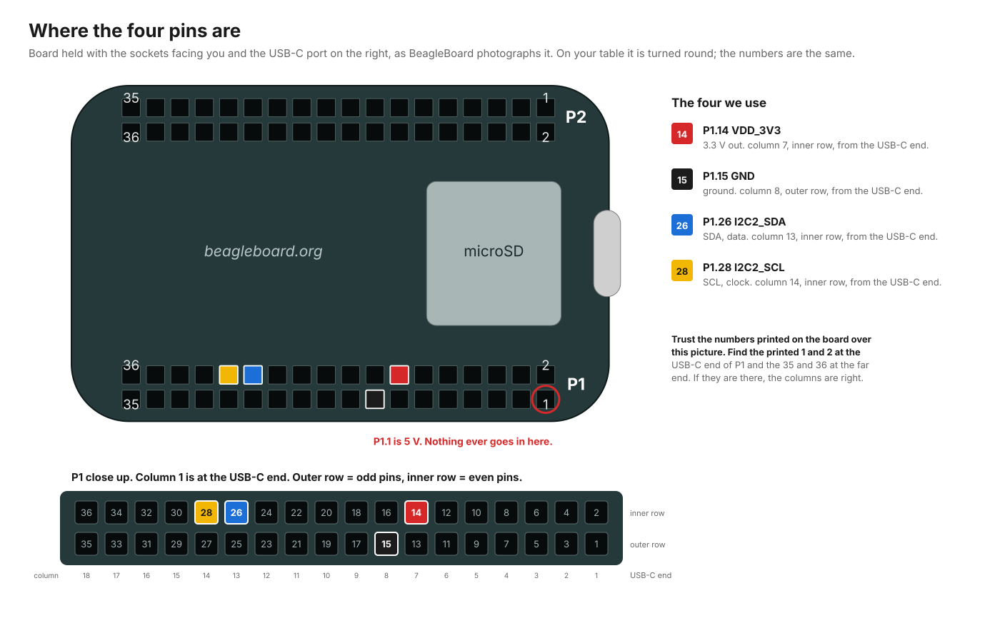
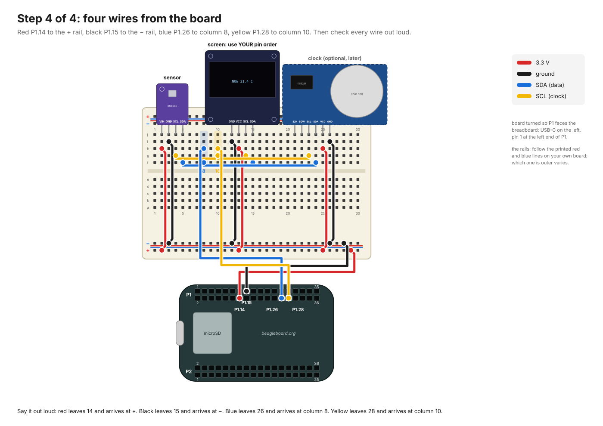

# First build, from zero

For someone who has never wired a board. Nothing here assumes you know what a
breadboard is, which end of a jumper goes where, or what I2C means. It takes
about two hours the first time, most of it waiting for downloads. Nothing you
do here can hurt you; a couple of mistakes can hurt the parts, and every one
of those is called out before the step where it can happen.

You need: a PocketBeagle 2, a microSD card (8 GB or more), a USB-C **data**
cable, a BME280 sensor board, a small OLED screen board, a breadboard, at
least eight jumper wires, and a Mac. A DS3231 clock module is optional.

If a step's result doesn't match what's written, stop there and read the
"if it doesn't" note under it. Don't go on to the next step hoping it sorts
itself out; each step is a check on the one before.

---

## Part 1: know the parts (10 minutes)

### The board



The PocketBeagle 2 is a computer the size of a large postage stamp. It has
two long strips of black sockets along its long edges, called **P1** and
**P2**. Each strip is two rows of 18 sockets, 36 in all, and each socket is
a numbered **pin** that the computer can talk through.

Hold the board so the **socket strips face up** and the **USB-C port is on
your right**. You should be looking at the side with the microSD slot and the
dog logo. In this position, P1 is the strip along the **bottom** edge and P2
along the top. Tiny numbers are printed on the board at the ends of each
strip: **1 and 2 at the USB-C end, 35 and 36 at the far end**. On P1, odd
numbered pins are in the outer row (nearest the edge), even numbered pins in
the inner row.

Find these four sockets on P1, counting columns from the USB-C end:

| Pin | Where | What it is |
|---|---|---|
| **P1.14** | column 7, inner row | 3.3 volt power out |
| **P1.15** | column 8, outer row | ground (the return path for power) |
| **P1.26** | column 13, inner row | SDA, the data wire |
| **P1.28** | column 14, inner row | SCL, the clock wire |

Put a bit of tape or a pencil dot next to them if it helps. Note that
**P1.1, the socket in the corner nearest the USB-C port, is 5 volts**. It
looks exactly like the others. We never use it, and a wire from it to any of
our modules will destroy that module.

Handle the board by its edges. Before you touch it the first time, touch
something metal and earthed (a radiator, the metal case of a plugged in
laptop charger) to let any static off your hands.

### The sensor: BME280

A board about the size of a fingernail with four (sometimes six) pins along
one edge. It measures temperature, air pressure and humidity. The pins are
labelled on the board in tiny letters: `VIN` or `VCC` (power in), `GND`
(ground), `SCL` (clock), `SDA` (data). If yours has `CSB` and `SDO` too,
ignore them; they stay unconnected.

If the pins are loose in a bag rather than soldered on, stop: they need
soldering first, and that is a separate job. The UK kit parts should arrive
with the header pins already attached. Check.

### The screen: SSD1306 OLED

A small dark glass rectangle on a board, four pins along the top edge:
`VCC`, `GND`, `SCL`, `SDA`. **The order of the first two varies by maker.**
Some boards go GND, VCC, SCL, SDA; others go VCC, GND, SCL, SDA. They look
identical otherwise. Read the letters printed beside the pins on *your*
screen and write the order down now. Getting VCC and GND backwards on the
screen is the one mistake in this guide that can kill a part instantly.

### The clock: DS3231 (optional, skip on the first build)

A module with a round coin cell holder and six pins along one edge: `32K`,
`SQW`, `SCL`, `SDA`, `VCC`, `GND`. Only the last four are used. Do not put a
battery in it yet; there is a warning about that in HARDWARE.md. On your
first build leave the clock in the bag. Add it once everything else works.

### The breadboard



A plastic slab full of holes. Inside, the holes are joined into hidden wires
in a fixed pattern, and that pattern is the whole trick:

- The two long rows along each edge, marked **+** (red line) and **−** (blue
  line), are **rails**. Every hole in a rail is joined to every other hole in
  that rail, end to end. We use one pair: + for 3.3 V, − for ground.
- The main area is split by a groove down the middle. On each side of the
  groove, the holes are in **columns of five**, and the five holes in one
  column are joined together. Column 3 above the groove is one wire; column 3
  below the groove is a different wire; column 4 is a different wire again.

So: to connect two things, put them in the same column. To connect something
to power, put a wire from its column to the + rail.

### Jumper wires

Short wires with a stiff pin at each end. They push into breadboard holes and
into the board's sockets. Colour is only a convention, but keep to it,
because it is how you check your work: **red for 3.3 V, black for ground,
blue for SDA, yellow (or white) for SCL**. If your pack lacks those colours,
pick four and write them down.

---

## Part 2: build it, with the USB cable still in the bag (20 minutes)

Do this on a clean table with the board **not plugged in**. Nothing is live
until the USB cable goes in at Part 4.

### Step 2.1: seat the modules

Push the sensor's pins into the top half of the breadboard so each pin sits
in its own column, with the module's body overhanging the top edge of the
breadboard. Press firmly and evenly; it takes more force than you expect,
and the pins should go in most of the way. The diagram uses columns 2 to 5.

Push the screen in the same way a few columns to the right, columns 9 to 12
in the diagram. Leave the clock out for now.

**Check:** every pin is in a different column. No two pins of one module
share a column. Both modules are in the same half (above the groove).

### Step 2.2: power to the modules

Run a **red** jumper from the sensor's `VIN`/`VCC` column (any free hole in
that column) to any hole in the **+ rail**. Run a **black** jumper from the
sensor's `GND` column to the **− rail**.

Do the same for the screen, using the pin order you wrote down in Part 1.

**Check, and this is the important one:** follow each red wire with your
finger from the rail back to the module and read the letter on the module
pin at that column. It must say VCC or VIN. Follow each black wire; it must
end at GND. If either is wrong, swap them now. A backwards screen dies the
moment power arrives.

### Step 2.3: the two shared wires

Choose two empty columns in the top half, away from the modules. The diagram
uses 17 for SDA and 19 for SCL. Nothing plugs into them directly; they are
meeting points.

- **Blue** jumper from the sensor's `SDA` column to column 17.
- **Blue** jumper from the screen's `SDA` column to column 17.
- **Yellow** jumper from the sensor's `SCL` column to column 19.
- **Yellow** jumper from the screen's `SCL` column to column 19.

Column 17 now joins both SDA pins together. Column 19 joins both SCL pins.

**Check:** two blue wires end in column 17 and nowhere else. Two yellow
wires end in column 19. No blue wire touches a yellow column.

### Step 2.4: the four wires to the board

Turn the board so P1 faces the breadboard (in the bench diagram that puts the
USB-C port on the left and pin 1 at the left end of P1). Count columns from
the pin 1 end.

- **Red** jumper: P1.14 (column 7, inner row) to the **+ rail**.
- **Black** jumper: P1.15 (column 8, outer row) to the **− rail**.
- **Blue** jumper: P1.26 (column 13, inner row) to breadboard column 17.
- **Yellow** jumper: P1.28 (column 14, inner row) to breadboard column 19.

Pushing a jumper into the board's sockets needs a firm straight push. If it
won't go, you are between sockets; look again.

**Check, slowly, out loud:** "Red leaves the board at fourteen, inner row,
and arrives at plus. Black leaves at fifteen, outer row, and arrives at
minus. Blue leaves at twenty-six and arrives at column seventeen, with the
other blues. Yellow leaves at twenty-eight and arrives at column nineteen,
with the other yellows." Count the columns on the board again from the pin 1
end. The nearest socket to the USB-C port in the outer row is P1.1, the 5 V
pin; make sure nothing is in it.

### Step 2.5: the final look

- Twelve wires in total: four on each module, four from the board.
- Nothing in P1.1.
- No wire end is floating loose.
- No two bare pins touch each other.

That is the whole circuit. It is four wires, shared.

---

## Part 3: put a system on the card (20 minutes, mostly download)

The board has no software of its own. It boots whatever is on the microSD
card. For the first test we use BeagleBoard's own image, which has the tools
for checking wiring built in, and none of our code. That way if something is
wrong we know it is the wiring.

1. On the Mac, download and open the **BeagleBoard Imaging Utility** from
   https://www.beagleboard.org/bb-imager. If macOS refuses to open it, right
   click the app, choose Open, and confirm.
2. Put the microSD card in a reader and plug the reader into the Mac.
3. In the utility: **Board**: PocketBeagle 2. **Image**: the newest entry
   whose name contains "Debian" and "IoT" (not "WorkShop"). **Storage**:
   your card. It will be listed by size; make sure it is the card and not
   your Mac's own disk.
4. Press **Edit**. Set a username (say `bench`) and a password you will
   remember. Leave the rest alone. Save.
5. Press **Write**. It downloads roughly 1 GB, writes, then verifies. Wait
   for it to say it is finished; it can take ten minutes.
6. Eject the card in Finder, take it out of the reader.

**If it doesn't:** "Write failed" usually means the card was ejected or the
reader is flaky. Try again with the card in a different USB port.

---

## Part 4: first power (5 minutes)

1. Slide the card into the slot on the board, label side facing outward
   (away from the board), until it clicks. It goes in most of the way and
   stays put.
2. Now, and only now, plug the USB-C cable into the board and the other end
   into the Mac.
3. Watch the board. A power light comes on at once. Within about ten
   seconds one or more small lights start to blink: that is Linux starting.
   The screen on the breadboard stays **dark** on this image, and that is
   correct: BeagleBoard's image doesn't know about the screen. It lights up
   in Part 6, once our software is on.
4. On the Mac, open **Terminal** (Spotlight: type Terminal).

**If it doesn't:** no lights at all means no power: try another USB-C port
on the Mac, then another cable. A power light but no blinking after a
minute means the card isn't seated or the write didn't finish; power off
(unplug), reseat the card, try again.

---

## Part 5: prove the wiring (10 minutes)

Everything in this part is typed into Terminal. Type each line, press
return, read what comes back.

### 5.1 Reach the board

```
ssh bench@192.168.6.2
```

(Use the username you chose. If that address doesn't answer after a few
seconds, `Control-C` and try `192.168.7.2`.) The first time, it asks whether
to trust the new host: type `yes`. Then it asks for the password. Nothing
appears as you type it; that's normal. You now have a prompt on the board
itself, something like `bench@BeagleBone:~$`.

**If it doesn't:** "Connection refused" or a long silence: give it another
30 seconds; the board takes a while on first boot. Still nothing: on the Mac,
System Settings, Network. A new entry (often called "BeagleBone" or "RNDIS")
should have appeared when you plugged in. If not, the cable is charge only.
Change the cable. This is the single most common failure.

### 5.2 See the I2C buses

```
ls /dev/i2c-*
```

Expect exactly: `/dev/i2c-0  /dev/i2c-2  /dev/i2c-3`. There is no `i2c-1`;
that is correct on this board. `i2c-2` is the one wired to P1.26 and P1.28.

### 5.3 See who is on the wire

```
sudo i2cdetect -y -r 2
```

(`sudo` asks for your password again.) You get a grid of dashes. Somewhere in
it two numbers should appear:

```
     0  1  2  3  4  5  6  7  8  9  a  b  c  d  e  f
00:                         -- -- -- -- -- -- -- --
10: -- -- -- -- -- -- -- -- -- -- -- -- -- -- -- --
20: -- -- -- -- -- -- -- -- -- -- -- -- -- -- -- --
30: -- -- -- -- -- -- -- -- -- -- -- -- 3c -- -- --
40: -- -- -- -- -- -- -- -- -- -- -- -- -- -- -- --
50: -- -- -- -- -- -- -- -- -- -- -- -- -- -- -- --
60: -- -- -- -- -- -- -- -- -- -- -- -- -- -- -- --
70: -- -- -- -- -- -- 76 --
```

`3c` is the screen answering. `76` (or `77`) is the sensor answering. **If
you see both, the wiring is right.** Take a photo of the breadboard; that is
the reference photo for every station after this one.

**If it doesn't:**

| Grid shows | Meaning | Do |
|---|---|---|
| `3c` only | screen fine, sensor not answering | unplug USB. check the sensor's four wires, especially that its SDA and SCL wires reach columns 17 and 19 |
| `76`/`77` only | sensor fine, screen not | unplug USB. check the screen's wires; recheck the pin order you wrote down |
| nothing | neither answers | unplug USB. most likely SDA and SCL are swapped at the board end (P1.26 vs P1.28), or the red or black wire from the board isn't in the rail |
| `command not found` | the tool isn't installed on this image | `sudo apt update && sudo apt install -y i2c-tools`, which needs the board to have internet: see Part 6, step 1 |
| a whole row of numbers | SDA and SCL shorted together or to power | unplug USB immediately. look for two bare pins touching |

### 5.4 Ask the sensor what it is

```
sudo i2cget -y 2 0x76 0xd0
```

(Use `0x77` if that is where it appeared.) `0x60` means a real BME280.
`0x58` means a BMP280, which is the same board without the humidity sensor;
it still works, humidity will show as `--`. Anything else, or an error,
means the sensor's data wires are marginal: reseat them.

Wiring is done. Type `exit` to leave the board.

---

## Part 6: put our software on it (30 minutes)

Now the same card gets the weather station software on top of BeagleBoard's
image. This is the software that will be on the release image, tested here
before it is published. It needs internet on the board once, to fetch three
small packages.

### 6.1 Give the board internet through the Mac

On the Mac: System Settings, General, Sharing, **Internet Sharing**. Click
the (i) next to it. Share your connection from: Wi-Fi. To computers using:
tick the BeagleBone / RNDIS entry. Close, then switch Internet Sharing on and
confirm.

### 6.2 Copy the software over

Still on the Mac, in Terminal. This assumes your clone of the repo is at
`~/build-break-own` (from the earlier git steps; if it is elsewhere, change
the path):

```
cd ~/build-break-own
scp -r sovereign-weather-station bench@192.168.6.2:~/
```

It asks for the board's password and copies the folder.

### 6.3 Install it

```
ssh bench@192.168.6.2
cd sovereign-weather-station
sudo ./setup.sh
```

It prints what it is doing: installs packages (this is the part that needs
internet), copies files to `/opt/sws`, enables three services, and ends
with `done. reboot, then run: sws-check`. Every change it makes is listed in
CHANGES.md, so nothing here is hidden.

**If it doesn't:** errors about `apt-get update` or "Temporary failure
resolving" mean the board has no internet; go back to 6.1. Anything else,
copy the last ten lines it printed and open an issue.

```
sudo reboot
```

Your terminal disconnects. Wait a minute. **Watch the screen on the
breadboard: it should light up and show `NOW` with a temperature.** Every
five seconds it changes page.

### 6.4 Run the check

```
ssh bench@192.168.6.2
sws-check
```

Five questions. Read each answer. Question 2 should list `0x3C` and your
sensor. Question 3 should say "real BME280". Question 5 should say there is
no radio on this board. Question 4 will say the time came from
`fake-hwclock`, which is correct without a clock module.

```
sws-live
```

A line every two seconds. Cup your hand over the sensor, or breathe on it:
the temperature and humidity move within a few readings. `Control-C` stops
it.

**If it doesn't:** screen dark but `sws-check` found `0x3C`:

```
journalctl -u station -n 30
```

and read the last lines. Paste them into an issue if they don't make sense.

### 6.5 Leave it running

Unplug the USB cable. Plug the board into a USB power bank or phone charger.
The screen keeps cycling. That is a weather station with no network that
answers to nobody. Leave it overnight. In the morning, plug the USB back into
the Mac, `ssh` in, and:

```
cat /data/readings.csv
```

One line per five minutes, written to the card once an hour.

---

## Part 7: add the clock (optional, 15 minutes)

Only after Parts 1 to 6 pass, and only after reading the battery warning in
HARDWARE.md. With the USB unplugged: seat the DS3231 in the top half of the
breadboard (columns 24 to 29 in the diagram), and run four jumpers exactly
as for the other modules: `VCC` to +, `GND` to −, `SDA` to column 17, `SCL`
to column 19. `32K` and `SQW` stay empty. Fit the coin cell **only if** you
have disabled the module's charging resistor or are using a rechargeable
LIR2032.

Plug in, wait a minute, `ssh` in, `sws-check`. Question 2 now also lists
`0x68` (and `0x57`), and question 4 says a hardware clock is bound. The clock
module knows nothing yet, so set it once by hand. Look at a real clock, and
type the current time in UTC (UK summer time minus one hour, UK winter time
as is):

```
sudo date -u -s "2026-10-01 14:30:00"
sudo hwclock -w --utc
```

The first line sets the board's clock; the second copies it into the
DS3231, which keeps it on the coin cell.

From now on the board keeps time through power cuts.

---

## What you have proved

- The four wire I2C bus works on P1.14 / P1.15 / P1.26 / P1.28.
- The screen and sensor are the parts you think they are.
- Our software installs cleanly on BeagleBoard's current image and runs
  with no network.
- The card can be cloned: FLASHING.md, from here.

Write down: which address your sensor answered at, the pin order of your
screen, the date, and the base image name from the imaging utility. Put it
in the repo as a note in `HARDWARE.md` under a "Tested" heading. The next
person starts from there.
