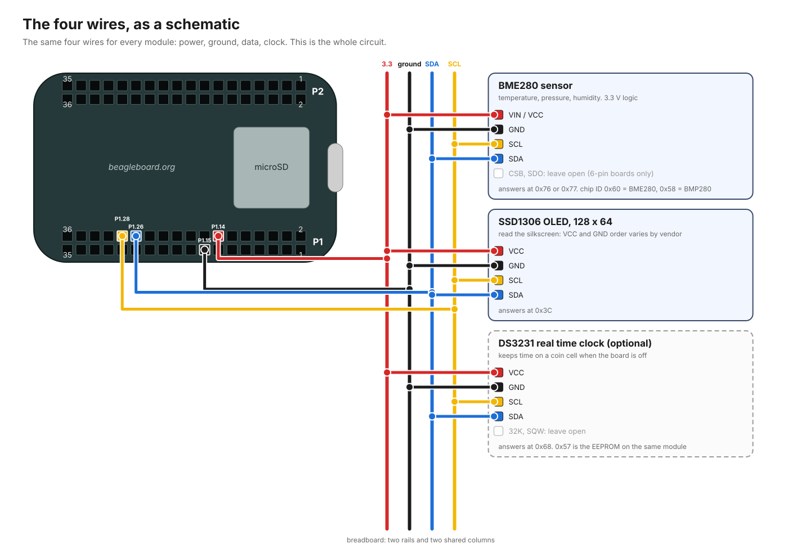

# Wiring card

Print one per table. Four wires. Every module gets all four.




Two kits, two wiring sections, same four pins. [Which kit do you have?](images/choose-kit.svg)

**Kit A, breadboard:** [step 1](images/bench-A-step1.svg), [step 2](images/bench-A-step2.svg), [step 3](images/bench-A-step3.svg), [step 4](images/bench-A-step4.svg). Print: [FIRST-BUILD-kit-A.pdf](images/print/FIRST-BUILD-kit-A.pdf).

**Kit B, direct, no breadboard:** [step 1](images/bench-B-step1.svg), [step 2](images/bench-B-step2.svg). Print: [FIRST-BUILD-kit-B.pdf](images/print/FIRST-BUILD-kit-B.pdf).

```
PocketBeagle 2, P1 header (the header on the USB-C side)

   P1.14  VDD_3V3  ──────┬──── VIN/VCC (BME280)
                         ├──── VCC     (OLED)
                         └──── VCC     (DS3231, if fitted)

   P1.15  GND      ──────┬──── GND     (BME280)
                         ├──── GND     (OLED)
                         └──── GND     (DS3231)

   P1.26  SDA      ──────┬──── SDA     (BME280)
                         ├──── SDA     (OLED)
                         └──── SDA     (DS3231)

   P1.28  SCL      ──────┬──── SCL     (BME280)
                         ├──── SCL     (OLED)
                         └──── SCL     (DS3231)
```

## Kit A: on the mini breadboard

1. Sensor pins in row j, columns 1 to 4. Screen pins in row j, columns 9 to 12. Bodies hang off the top edge.
2. Columns 14 to 17 are the four shared wires: 14 is 3.3 V, 15 is ground, 16 is SDA, 17 is SCL. There are no power rails on a 170 point board; these columns do that job.
3. From the board, row h: **P1.14** to 14, **P1.15** to 15, **P1.26** to 16, **P1.28** to 17.
4. From the sensor, row f: VIN to 14, GND to 15, SDA to 16, SCL to 17.
5. From the screen, row g, in your screen's pin order: VCC to 14, GND to 15, SDA to 16, SCL to 17.

## Kit B: no breadboard

Four male-to-female wires, pin end in the board, socket end on the module. One module at a time: **P1.14** to VIN/VCC, **P1.15** to GND, **P1.26** to SDA, **P1.28** to SCL. Sensor first; unplug, then the screen.

The header is two rows of pins. With the sockets facing you and the USB-C
port on your right, P1 is the bottom strip; pins 1 and 2 are at the USB-C
end, 35 and 36 at the far end; odd pins are the outer row. So P1.14 is column
7 from the USB-C end, inner row; P1.15 column 8, outer row; P1.26 column 13,
inner; P1.28 column 14, inner. The numbers are printed on the board; trust
those over this paragraph.

## Each module's pins

**BME280, 4 pin (HiLetgo):** `VIN  GND  SCL  SDA`. VIN takes 3.3 V.

**BME280, 6 pin:** `VCC  GND  SCL  SDA  CSB  SDO`. Leave CSB and SDO empty.

**SSD1306 OLED:** four pins, but **check which order**. Common layouts are
`GND VCC SCL SDA` and `VCC GND SCL SDA`. Read the letters printed next to the
pins on your own screen. Getting VCC and GND backwards can destroy it.

**DS3231 (ZS-042 module):** `32K  SQW  SCL  SDA  VCC  GND` on the long edge.
Use the last four. Leave 32K and SQW empty. Fit the coin cell only after
reading the battery note in HARDWARE.md.

## Before you plug in the USB cable

1. Count the pins twice.
2. 3V3 goes to VCC or VIN. Ground goes to GND. Get these two wrong on any module and it dies.
3. SDA to SDA, SCL to SCL. Get these swapped and nothing answers, but nothing breaks.
4. Nothing goes to P1.01. That pin is 5 V.

## What "working" looks like

Screen lights within about 40 seconds of power and shows `NOW` with a
temperature. Every five seconds it changes page: `NOW`, `SINCE START`,
`MONTH CARD`.

## Behind the pins

| Pin | Name on the board | Job |
|---|---|---|
| P1.14 | VDD_3V3 | 3.3 volt power out |
| P1.15 | GND | ground |
| P1.26 | I2C2_SDA | data, both directions |
| P1.28 | I2C2_SCL | clock, the board sets the pace |

These are the AM62's `main_i2c2` controller. On the official Debian image it
is `/dev/i2c-2`. `/dev/i2c-0` is the board talking to itself (its EEPROM at
0x50 and ADC at 0x20). There is no `/dev/i2c-1`.

## Who answers on the bus

| Address | Device |
|---|---|
| `0x3C` | the screen |
| `0x76` or `0x77` | the sensor (depends on the breakout) |
| `0x68` | the clock, if fitted |
| `0x57` | the EEPROM that rides on the clock module. ignored |

Run `sws-check` to see them explained. Run `sudo i2cdetect -y -r 2` to see
them raw.
